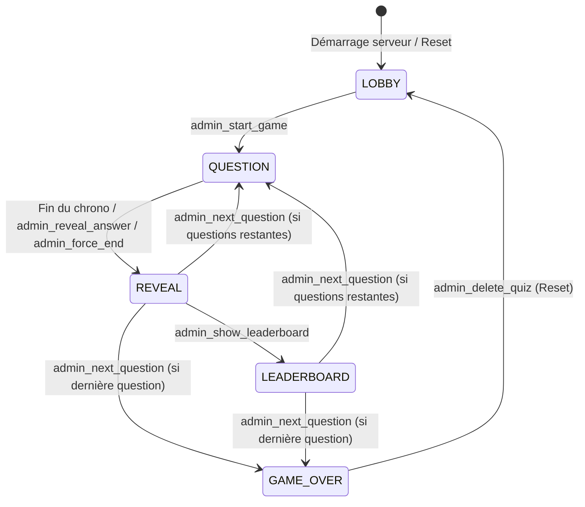

# 📖 SPECIFICATION TECHNIQUE & GUIDE COMPLET DU PROJET (POUR IA & DÉVELOPPEURS)

> Ce document fournit une analyse exhaustive de l'architecture, du modèle de données, du protocole WebSocket temps réel, du système de scoring, des 5 thèmes graphiques et de la procédure de déploiement de l'application **Realtime Quiz (Kahoot-Style Sans PIN)**.

---

## 1. VUE D'ENSEMBLE DU PROJET

- **Nom du projet** : `realtime-quiz`
- **Objectif** : Application web de quiz interactif multijoueur en temps réel sans code PIN.
- **Philosophie technique** :
  - **Backend** : Node.js + Express (serveur HTTP & API REST) + Socket.io (WebSocket bidirectionnel) + Multer (gestion des médias).
  - **Frontend** : Vanilla HTML5, CSS3 moderne (Variables CSS, Flexbox/Grid, Glassmorphism, animations) et JavaScript Vanilla ES6+. Aucun framework lourd (pas de React/Vue/Angular) pour garantir une légèreté extrême, un chargement instantané et une maintenance aisée.
  - **Stockage** : Objet en mémoire `gameState` sur le serveur + dossier `/uploads` pour les images + export/import JSON pour la persistance et la portabilité des quiz.

---

## 2. ARBORESCENCE ET RÔLE DES FICHIERS

```text
realtime-quiz/
├── package.json               # Dépendances (express, socket.io, multer, qrcode) et scripts
├── server.js                  # Cœur backend : serveur Express, Socket.io, gameState, chronos & uploads
├── uploads/                   # Dossier contenant les images uploadées pour les questions
├── public/                    # Fichiers statiques servis aux clients
│   ├── index.html             # Page Joueur (Invité /)
│   ├── display.html           # Page Grand Écran / Vidéoprojecteur (/display)
│   ├── admin.html             # Page Régie Animateur (/admin)
│   ├── builder.html           # Page Créateur de Quiz & Thèmes (/admin/builder)
│   ├── sample-quiz.json       # Modèle de quiz pré-rempli (3 à 6 choix, réponses multiples)
│   ├── css/
│   │   └── style.css          # Design system complet & styles des 5 thèmes graphiques
│   └── js/
│       ├── guest.js           # Client Joueur : gestion UUID localStorage, vote continu, thèmes
│       ├── display.js         # Client Grand Écran : QR code dynamique, histogramme, podium, chrono
│       ├── admin.js           # Client Régie : dashboard temps réel, contrôles chrono, modale reset
│       ├── builder.js         # Client Builder : upload image (Multer), réordonnancement, export/import
│       └── confetti.js        # Moteur Canvas léger pour les célébrations et le podium
└── PROJECT_DOCUMENTATION_AI.md # Ce document de référence
```

---

## 3. MODÈLE DE DONNÉES & ÉTAT EN MÉMOIRE (`gameState`)

L'état de la partie est maintenu dans une variable globale en mémoire dans `server.js` :

```typescript
interface GameState {
  status: 'LOBBY' | 'QUESTION' | 'REVEAL' | 'LEADERBOARD' | 'GAME_OVER';
  title: string;
  theme: 'quizz-moderne' | 'geek-it' | 'mariage-automne' | 'windows-xp' | 'synthwave-arcade';
  currentQuestionIndex: number;
  timeRemaining: number;
  totalQuestionTime: number;
  isTimerPaused: boolean;
  questionStartTime: number | null;
  questions: Question[];
  players: Record<string, Player>;
  history: any[];
}

interface Question {
  id: string;
  prompt: string;
  image: string | null;            // URL relative (ex: '/uploads/quiz-img-1234.png')
  choices: Choice[];               // 3 à 6 choix (IDs: 'A', 'B', 'C', 'D', 'E', 'F')
  correctChoices: string[];        // Ex: ['A'] ou ['A', 'C'] pour les réponses multiples
  timer: number;                   // Durée en secondes (ex: 20)
  hostNote: string;                // Note ou blague destinée exclusivement à l'animateur
  hint: string;                    // Indice destiné au public
}

interface Choice {
  id: 'A' | 'B' | 'C' | 'D' | 'E' | 'F';
  text: string;
}

interface Player {
  id: string;                      // UUID stocké dans le localStorage du client
  name: string;                    // Prénom saisi au 1er accès (max 25 caractères)
  score: number;                   // Score cumulé total
  isConnected: boolean;
  socketId: string;
  currentAnswer: {
    choices: string[];             // Choix actuellement sélectionnés (ex: ['A', 'C'])
    timeTaken: number;             // Temps écoulé en secondes
    pointsEarned: number;          // Points attribués après révélation
  } | null;
}
```

---

## 4. MACHINE À ÉTATS FINIS (FSM)



### Règles de transition et confidentialité :
1. **Phase `LOBBY`** :
   - Les invités se connectent avec leur prénom.
   - Le Grand Écran affiche le **QR Code dynamique** (`window.location.origin + '/'`) et la grille des joueurs connectés en direct.
2. **Phase `QUESTION`** :
   - Le chronomètre décrémente chaque seconde et synchronise tous les clients (`timer_tick`).
   - Le **Grand Écran** affiche l'énoncé de la question, l'image d'illustration éventuelle, les choix possibles et le chronomètre circulaire.
   - Les **Joueurs** voient **uniquement les boutons de choix (couleur + texte)**. L'image et l'énoncé sont masqués pour forcer l'attention sur l'écran de projection.
   - **Vote continu** : Le joueur peut sélectionner / modifier son vote à volonté. Le choix actif au moment de la clôture est celui retenu.
   - **Anti-Spoiler** : Aucun joueur ne sait s'il a eu bon ou faux durant cette phase.
3. **Phase `REVEAL`** :
   - Déclenchée par l'expiration du temps ou par l'animateur via **"Afficher la réponse"**.
   - Calcul immédiat des points.
   - Le Grand Écran affiche l'histogramme des votes et illumine les bonnes réponses.
   - Chaque smartphone joueur affiche son écran de résultat personnalisé (Bonne réponse / Partiel / Mauvaise réponse, points gagnés).
4. **Phase `LEADERBOARD` & `GAME_OVER`** :
   - Affichage du Top 5 et du Podium animé (1er, 2e, 3e) avec pluie de confettis.

---

## 5. MOTEUR DE SCORE & FORMULE MATHÉMATIQUE

Pour chaque question, le calcul des points s'effectue selon la formule officielle Kahoot basée sur la rapidité et la justesse :

### A. Question à réponse unique :
Si le choix du joueur correspond à la bonne réponse :
$$\text{Points} = \text{Math.round}\left(1000 \times \left(1 - \frac{\text{TempsÉcoulé}}{\text{TempsTotal}} \times 0.5\right)\right)$$
- Réponse instantanée ($t \approx 0$) $\rightarrow$ **1000 points**.
- Réponse à la dernière seconde ($t = t_{\text{total}}$) $\rightarrow$ **500 points**.
- Mauvaise réponse $\rightarrow$ **0 point**.

### B. Question à réponses multiples (Partiellement correcte) :
Soit $C_{\text{correct}}$ le nombre de bonnes réponses cochées par le joueur, $C_{\text{wrong}}$ le nombre de mauvaises réponses cochées, et $N_{\text{total\_correct}}$ le nombre total de bonnes réponses attendues :
$$\text{Fraction} = \max\left(0, \; \frac{C_{\text{correct}} - C_{\text{wrong}}}{N_{\text{total\_correct}}}\right)$$
$$\text{Points} = \text{Math.round}\left(\text{PointsMaxVitesse} \times \text{Fraction}\right)$$

---

## 6. PROTOCOLE WEBSOCKET (SOCKET.IO)

### Sockets Rooms :
- `guests` : Reçoit les états restreints (sans spoil).
- `display` : Reçoit l'état visuel public et les agrégats de statistiques.
- `admin` : Reçoit toutes les informations (bonnes réponses, notes animateur, N+1, métriques).

### Événements Client $\rightarrow$ Serveur :
| Événement | Émetteur | Payload | Action Serveur |
| :--- | :--- | :--- | :--- |
| `register_guest` | Joueur | `{ guestId: string, name: string }` | Enregistre/reconnecte le joueur, l'ajoute à la room `guests` |
| `register_display`| Grand Écran | *aucun* | Ajoute la socket à la room `display` |
| `register_admin`  | Régie Admin | *aucun* | Ajoute la socket à la room `admin` |
| `submit_answer`   | Joueur | `{ guestId: string, choices: string[] }` | Met à jour en continu les choix du joueur sans verrouillage |
| `admin_start_game`| Régie Admin | *aucun* | Initialise les scores à 0 et lance la Question 1 |
| `admin_reveal_answer` | Régie Admin | *aucun* | Stoppe le timer, calcule les scores et passe en `REVEAL` |
| `admin_show_leaderboard` | Régie Admin | *aucun* | Passe en état `LEADERBOARD` |
| `admin_next_question` | Régie Admin | *aucun* | Passe à la question $N+1$ ou `GAME_OVER` |
| `admin_pause_timer` | Régie Admin | *aucun* | Met en pause le chronomètre |
| `admin_resume_timer`| Régie Admin | *aucun* | Reprend le chronomètre |
| `admin_add_time`  | Régie Admin | `{ seconds: number }` | Ajoute +10s au chronomètre en cours |
| `admin_force_end` | Régie Admin | *aucun* | Force la fin immédiate et déclenche la révélation |
| `admin_delete_quiz`| Régie Admin | *aucun* | Vide `gameState` et supprime physiquement les fichiers dans `/uploads/` |

---

## 7. SYSTÈME DES 5 THÈMES GRAPHIQUES DYNAMIQUES

L'attribut `data-theme` est appliqué dynamiquement sur la balise `<body>` des pages **Joueur (`/`)** et **Grand Écran (`/display`)** selon la valeur de `gameState.theme` :

1. `quizz-moderne` : Dark glassmorphism, dégradés radiaux néon, 6 couleurs Kahoot vives, police *Outfit*.
2. `geek-it` : Écran terminal CRT / Matrix, vert phosphore & cyan luminescent, lignes de scan, police monospace *Fira Code* / *VT323*.
3. `mariage-automne` : Palette chaleureuse Terracotta, or ambré, vert sauge boisé et lie de vin, typographie sérif *Cinzel* & *Playfair Display*.
4. `windows-xp` : Rétro 2000s, fond Colline Bliss, fenêtres et barres bleu Luna, boutons 3D biseautés, police *Tahoma*.
5. `synthwave-arcade` : Grille wireframe au sol, coucher de soleil néon rétro, éclats rose & cyan laser, police pixel art *Press Start 2P*.

---

## 8. ROUTES DE L'API REST (EXPRESS)

- `GET /` : Page HTML Joueur (`public/index.html`).
- `GET /display` : Page HTML Grand Écran / Vidéoprojecteur (`public/display.html`).
- `GET /admin` : Page HTML Régie Animateur (`public/admin.html`).
- `GET /admin/builder` : Page HTML Créateur de Quiz (`public/builder.html`).
- `POST /api/upload` : Upload d'image multipart/form-data via Multer (renvoie `{ success: true, imageUrl: '/uploads/nom.ext' }`).
- `GET /api/quiz/data` : Renvoie les questions et le thème en cours pour le builder.
- `POST /api/quiz/save` : Sauvegarde les questions et le thème dans `gameState`.
- `GET /api/quiz/export/json` : Télécharge le fichier `quiz.json` (texte seul).
- `GET /api/quiz/export/zip` : Génère et télécharge une archive `quiz_complet.zip` contenant `quiz.json` ET toutes les images associées extraites de `/uploads/`.
- `POST /api/quiz/import/json` : Importe une structure JSON texte et met à jour `gameState`.
- `POST /api/quiz/import/zip` : Décompresse l'archive ZIP, extrait les images directement dans `/uploads/` et recharge le quiz avec toutes ses illustrations prêtes à l'emploi.
- `POST /api/quiz/sample` : Réinitialise avec le quiz de démonstration.

### ⚠️ Gestion du Stockage & Suppression Physique des Médias :
Lorsque l'animateur clique sur le bouton rouge **"SUPPRIMER LE QUIZZ"** dans la Régie (`admin_delete_quiz`) :
1. Le serveur exécute `fs.promises.readdir(UPLOADS_DIR)`.
2. Pour chaque fichier présent dans `/uploads/`, il exécute `fs.promises.unlink(filePath)` pour le détruire physiquement du disque dur afin de ne jamais saturer l'espace disque du serveur.
3. L'état en mémoire `gameState` est réinitialisé (`questions = []`, `players = {}`).
4. **Pour réutiliser un quiz avec ses images ultérieurement**, l'utilisateur utilise simplement l'option **"Exporter ZIP"** avant la suppression, puis **"Importer ZIP"** pour restaurer instantanément les questions et toutes leurs images dans `/uploads/`.

---

## 9. GUIDE DE DÉPLOIEMENT SUR N'IMPORTE QUELLE MACHINE

### A. Prérequis Système
- **Node.js** v18.0.0 ou supérieur (recommandé : Node.js LTS v20+ ou v24+).
- **npm** (inclus avec Node.js).

### B. Déploiement Local / LAN (Wi-Fi)
1. Cloner ou copier le dossier `realtime-quiz` sur la machine hôte.
2. Ouvrir un terminal dans le dossier et installer les dépendances :
   ```bash
   npm install
   ```
3. Lancer le serveur :
   ```bash
   node server.js
   ```
4. Trouver l'adresse IP locale de la machine hôte :
   - **Windows** : `ipconfig` (ex: `192.168.1.45`)
   - **Linux / macOS** : `ifconfig` ou `ip a`
5. **Connexions** :
   - Tous les participants connectés au même réseau Wi-Fi peuvent scanner le QR Code ou ouvrir `http://192.168.1.45:3000/`.
   - L'écran de vidéoprojection ouvre `http://localhost:3000/display`.
   - L'animateur ouvre `http://localhost:3000/admin`.

---

### C. Déploiement en Production avec PM2 (Linux / VPS)
```bash
# 1. Installation globale de PM2
npm install -g pm2

# 2. Lancement en arrière-plan avec restart automatique
pm2 start server.js --name "realtime-quiz"

# 3. Configuration au démarrage du système
pm2 startup
pm2 save
```

---

### D. Configuration Docker (Optionnel)

#### `Dockerfile` :
```dockerfile
FROM node:20-alpine
WORKDIR /app
COPY package*.json ./
RUN npm install --production
COPY . .
EXPOSE 3000
CMD ["node", "server.js"]
```

#### `docker-compose.yml` :
```yaml
version: '3.8'
services:
  quiz-app:
    build: .
    ports:
      - "3000:3000"
    volumes:
      - ./uploads:/app/uploads
    restart: always
```

---

## 10. RECOMMANDATIONS POUR LES FUTURES ÉVOLUTIONS PAR UNE IA

1. **Pas de framework lourd requis** : Conserver le code en Vanilla JS pour maintenir un chargement ultra-rapide sur mobile.
2. **Ajout de nouveaux thèmes** : Pour créer un 6ème thème, il suffit d'ajouter une entrée dans `choicesCountSelect` du builder et de définir les variables CSS sous `[data-theme="nouveau-theme"]` dans `style.css`.
3. **Persistance en BDD** : Si une base de données (SQLite, PostgreSQL, MongoDB) est requise à l'avenir, remplacer les lectures/écritures de `gameState` dans `server.js` par un ORM (Prisma / Drizzle).
